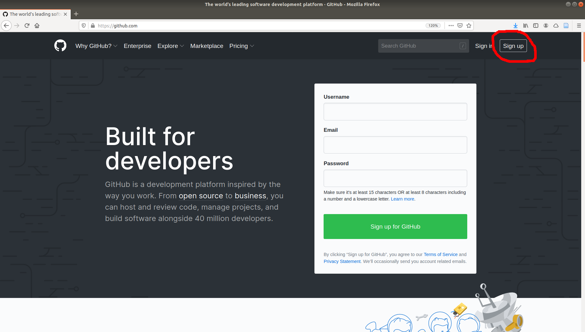
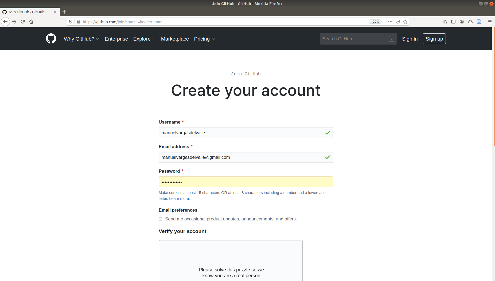
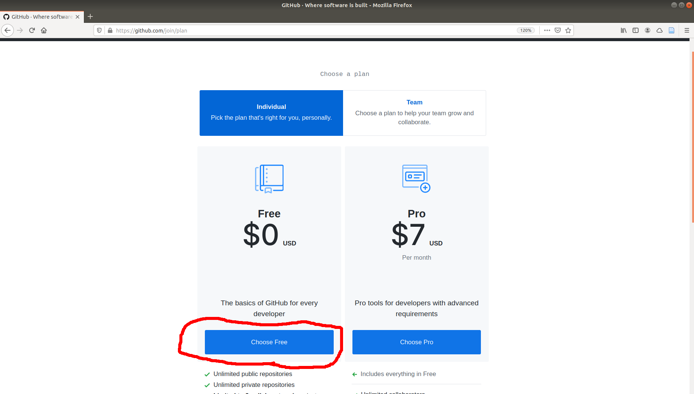
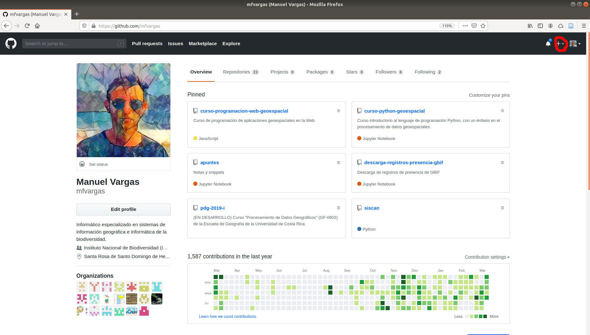
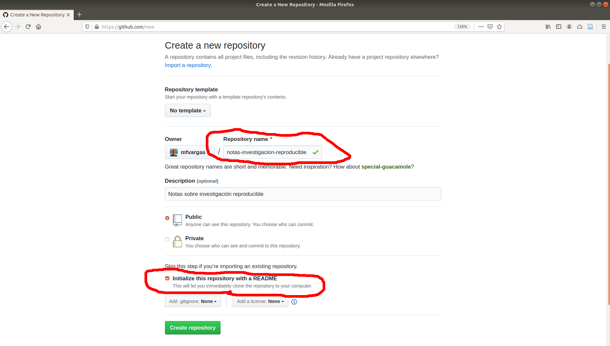
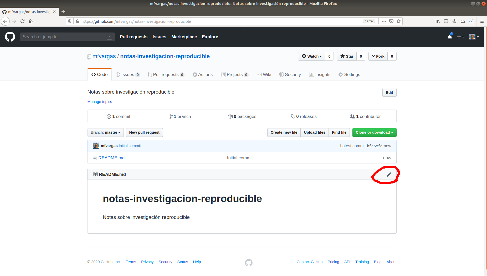
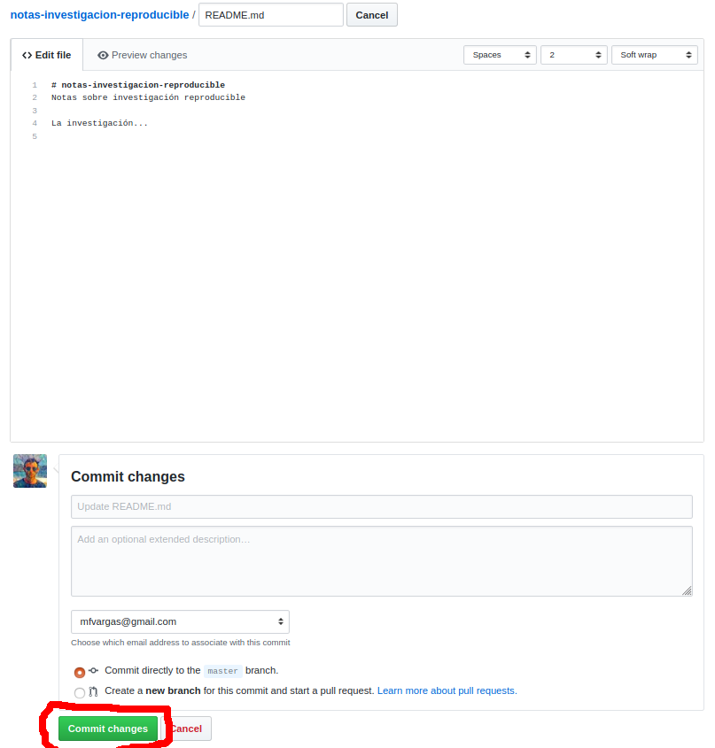
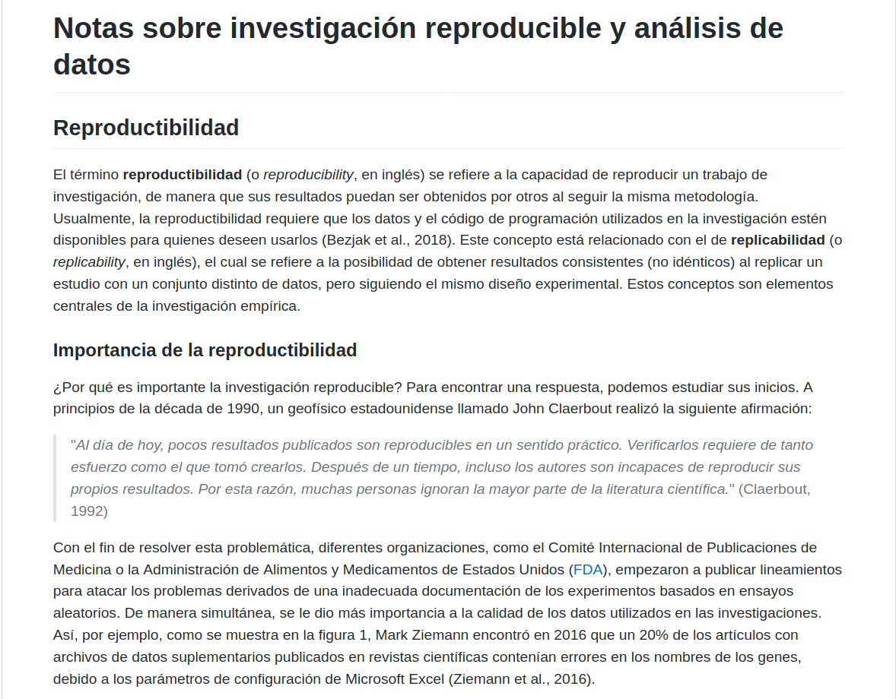
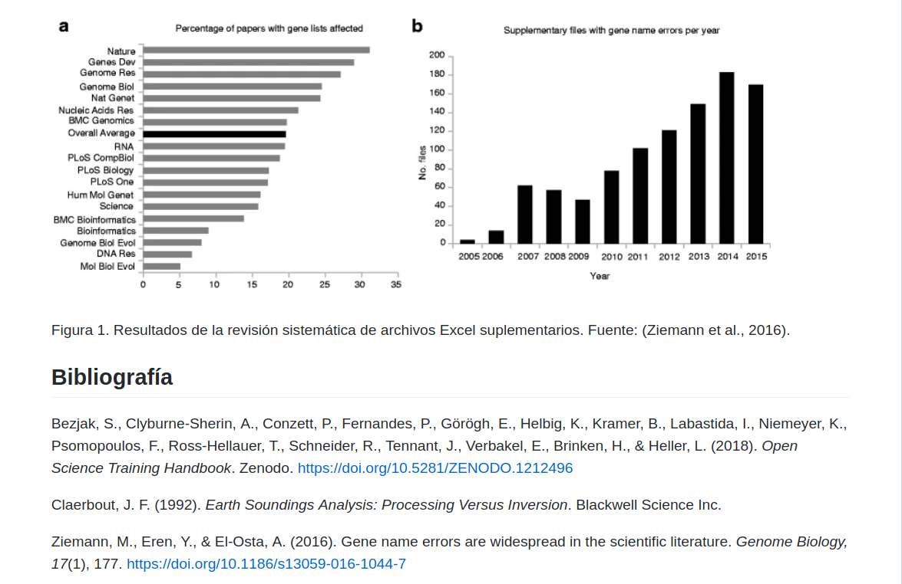

# 
# TPB708 Programación de aplicaciones en sistemas de información geográfica
## Tarea 01

### Fecha de entrega y entregables
La fecha límite de entrega es el **jueves 13 de agosto de 2020**.  

Cuando termine el laboratorio, envíele al profesor por correo electrónico la dirección del repositorio de GitHub resultante (ej. https://github.com/mfvargas/notas-investigacion-reproducible).

### Trabajo previo
Se recomienda, además de leer el material preparado por el profesor y consultar las fuentes listadas en este, seguir el tutorial [Markdown Tutorial](https://www.markdowntutorial.com/), para familiarizarse con la sintaxis de Markdown.

### Objetivos
Al finalizar este laboratorio, el estudiante será capaz de:

1. Crear repositorios y documentos en GitHub.
2. Publicar documentos con sintaxis Markdown en GitHub.

### Desarrollo
1. Si no tiene aún un usuario en [GitHub](https://github.com/), cree uno con la opción de `Sign Up` de la página principal (**Sugerencia**: seleccione el plan gratuito, es suficiente para completar este laboratorio y los restantes de este curso).

2. Cree un nuevo repositorio con la opción `New repository` (con el `+` que está en la parte superior derecha). Denomínelo `notas-investigacion-reproducible` y marque la casilla `Initialize this repository with a README `. Cuando esté listo, presione el botón `Create repository`.

3. Ahora debe poder ver el nuevo repositorio en su perfil de GitHub. Ingrese al repositorio y edite el archivo README.md con la opción `Edit this file` (el lápiz que está arriba a la derecha).

4. En la pantalla de edición, puede escribir texto en sintaxis MarkDown. Cuando deseee guardar los resultados, presione el botón `Commit Changes` en la parte inferior.

5. Ingrese en README.md la sintaxis Markdown para obtener un documento que se visualice como en las siguientes figuras. Note, entre otros aspectos:

- Los encabezados.
- Las negritas e itálicas.
- Las citas textuales.
- La figura (el archivo está en [ZiemannEtAlFig1.png](ZiemannEtAlFig1.png), puede descargarlo de esa dirección).
- Los hipervínculos (incluya uno al sitio web de la FDA en https://www.fda.gov/, en donde se mencionan las siglas).

**Vista final del documento**

